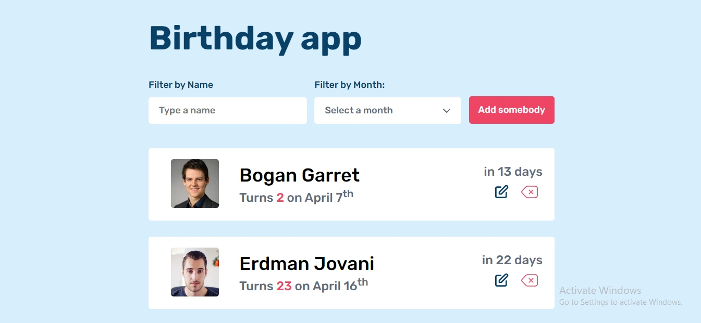

<h1 align="center">Birhday App</h1>

<div align="center">
  <h3>
    <a href="https://github.com/Betsimisaraka/birthday-app">
      Demo
    </a>
    <span> | </span>
    <a href="https://birthday-app-anita.netlify.app/">
      Solution
    </a>
  </h3>
</div>


In this project my goal is to display lists of people by fetching data from an API with people's birth date and their avatar. And calculating their next birthday from the current day. Then I sorted the people by the one who has the nearest birthday date.

## Overview



### Build with

-   [Vanilla Javascript](https://reactjs.org/)
-   [Html](https://html.org/)
-   [Css](https://css.org)

## Functionality

The functionality of this project are:

- I can see the lists of people with their avatar, date of birth and their next birthday.
- I can delete a person from the list.
- I can edit a person's information.
- I can add a new person to the lists.
- I can filter the list by the people's firstname and lastname and by the month of the date of birth.
- I can reset the select input by selecting the first option.

## How to use

To clone and run this application, you'll need [Git](https://git-scm.com), [Node.js](https://nodejs.org/en/download/) (which comes with [npm](http://npmjs.com)) and [parcel bundler](https://parceljs.org/getting_started.html) installed on your computer. Or you can run this with a live server. From your command line: 

```bash
# Clone this repository
$ git clone https://github.com/Betsimisaraka/birthday-app

# Install dependencies
$ npm install

# Run the app
$ npm start
```

## Figma

Here is the link of the design in [Figma](https://www.figma.com/file/bb1Mie5R3mUhR77PtGG8bJ/Birthday-App?node-id=0%3A1)

## Contact

GitHub [Betsimisaka](https://{github.com/Betsimisaraka})
